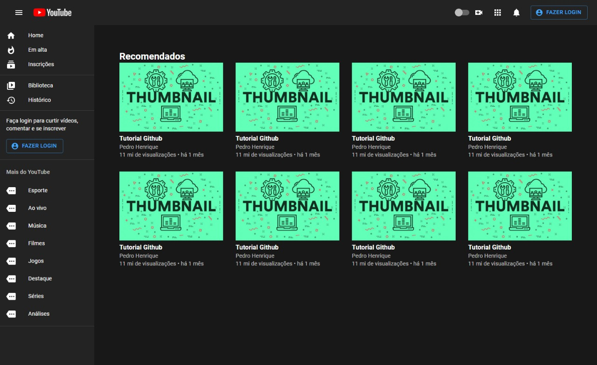
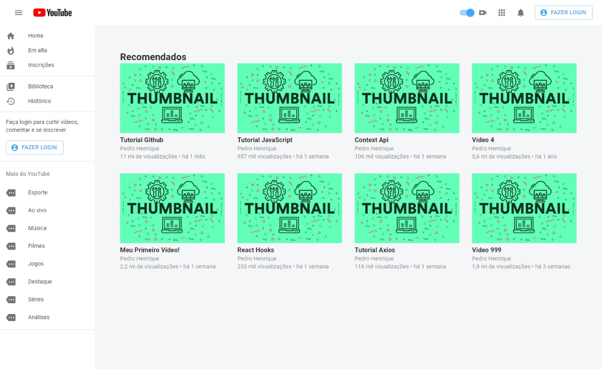
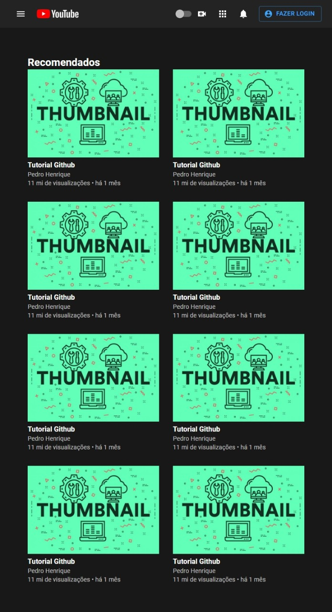

# Youtube Home Page Clone
## :book: About
Youtube home page clone using ReactJS and [Material-ui](https://material-ui.com/).

## :rocket: Main technologies
 * [ReactJS](https://pt-br.reactjs.org/)
 * [Material-UI](https://material-ui.com/)
 * [Styled Components](https://styled-components.com/)

## 💻 Layout
### Desktop
#### Dark Mode
<br>


#### Light Mode


### Mobile


## :electric_plug: Running the project
To run the project you must have installed on your computer the following technologies:
* [NodeJS](https://nodejs.org/en/)
* [Yarn](https://yarnpkg.com/)
* [Git](https://git-scm.com)

```bash
  # Clone the repository.
  $ git clone https://github.com/phb2000/youtube-home-clone.git
  
  # Go to the project folder using cmd
  $ cd youtube-home-clone
  
  # Install the dependecies using the following command:
  $ yarn install
  
  # Start the application
  $ yarn start
```

Now you can access [localhost](http://localhost:3000/) and use the project.
